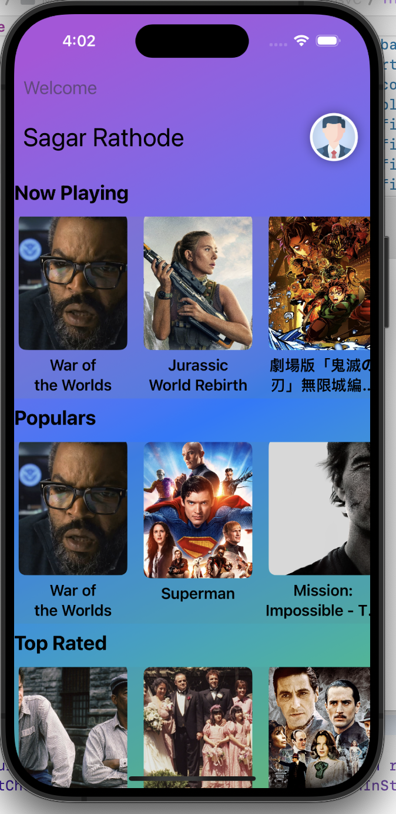
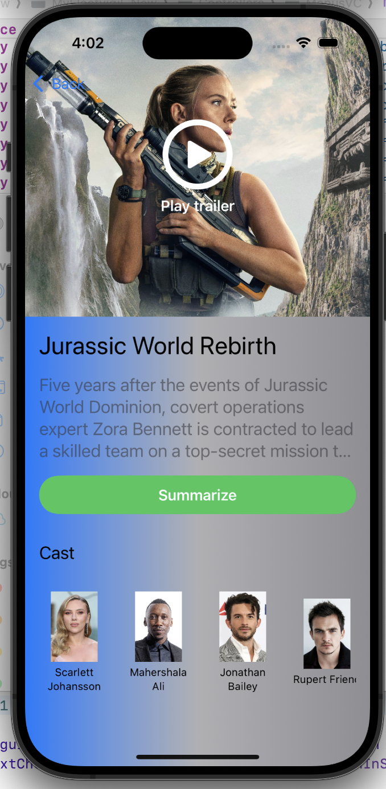
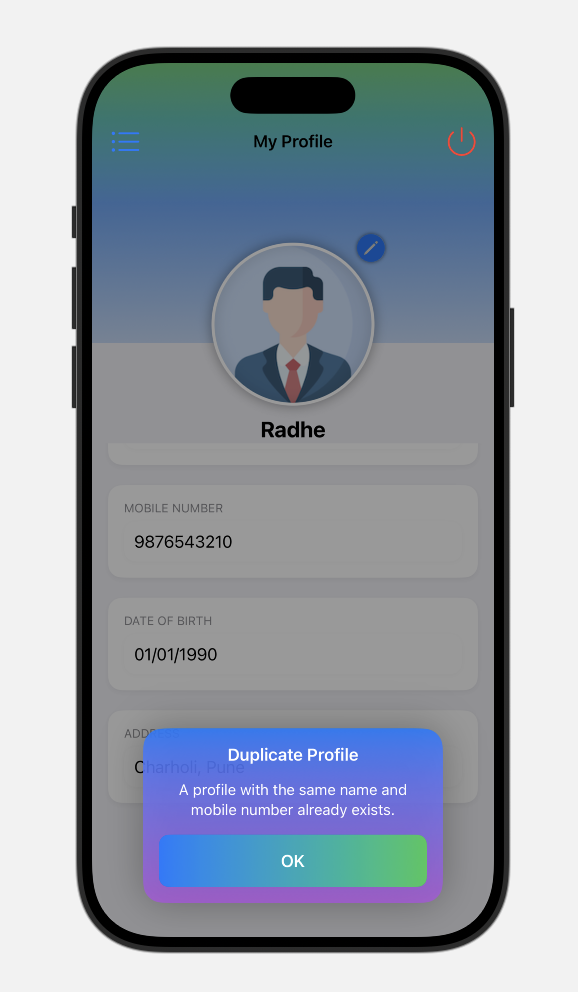
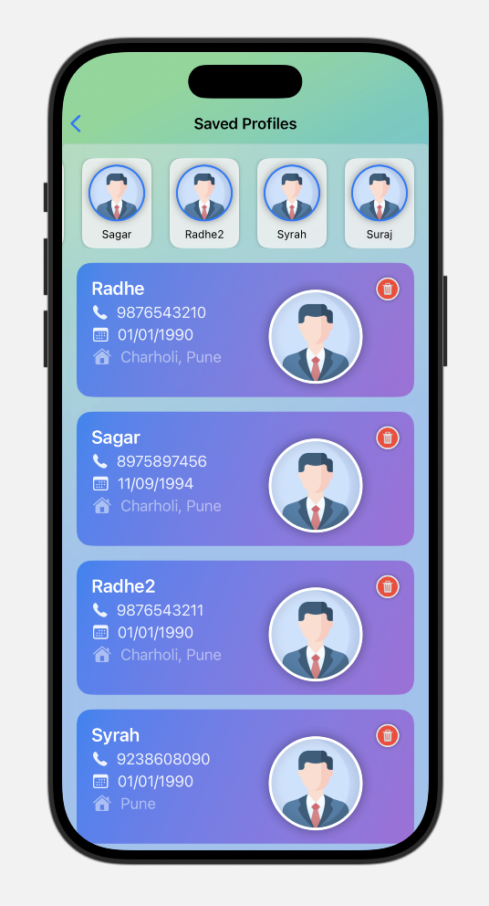

# TMDB Movie App 🎬

A simple movie app built with **SwiftUI** and **MVVM**, integrating with the [TMDB API](https://www.themoviedb.org/documentation/api) to fetch and display popular movies.

---

## 🚀 Features
- ✅ Login and Signup ,Custom alertView,LinearGradient,ActivityIndicator,List
- ✅ Fetch popular movies using TMDB API
- ✅ Display movie title, overview, and poster image
- ✅ Uses SwiftUI's `AsyncImage` for loading images
- ✅ Clean MVVM architecture
- ✅ Swift Concurrency (`async/await`) for networking

---

## 📸 Screenshots/GIF

## 🎬 Video Link: https://youtu.be/wOTo3ZRJXYg

  
  
  
  
  
  

